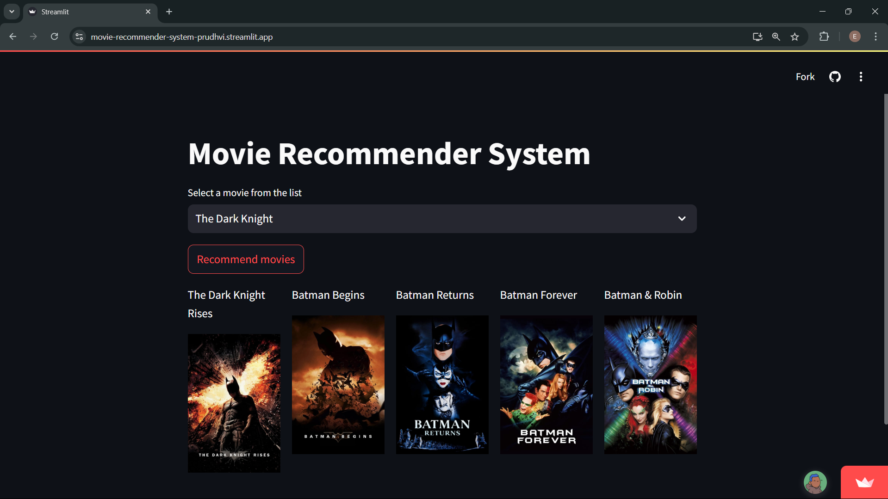

# Movie Recommender System

## Overview

This project implements a **Content-Based Movie Recommender System** in Python. The system recommends movies to users based on the movies they like, using a **cosine similarity** approach to compare the features of movies. It utilizes the [TMDB-5000 Movie Dataset](https://www.kaggle.com/datasets/tmdb/tmdb-movie-metadata?resource=download) to generate the recommendations.


---

## Requirements

Make sure you have the following libraries installed:

- `pandas`
- `numpy`
- `sklearn`
- `nltk`
- `streamlit` (for building the UI)

You can install the required libraries using pip:

```bash
pip install pandas numpy scikit-learn nltk streamlit
```

---

## Setup and Installation

1. **Fork the Repository**

2. **Clone the Repository**
   ```bash
   git clone <repository_url>
   ```

3. **Download the Dataset**
   - Download the [TMDB-5000 Movie Dataset](https://www.kaggle.com/datasets/tmdb/tmdb-movie-metadata?resource=download).
   - Download the [TMDB-5000 Credits Dataset](https://www.kaggle.com/datasets/tmdb/tmdb-movie-metadata?resource=download)
   - Place the dataset files in the `datasets` folder.
4. **Run the App with Streamlit**
   - Open a terminal and navigate to the project folder.
   - Run the Streamlit app:
     ```bash
     streamlit run app.py
     ```

   This will open the web-based interface where you can input a movie and get recommendations.

---

## How the System Works

1. **Data Preprocessing**:
   - The dataset is loaded, cleaned, and relevant movie details are extracted (e.g., title, genres, plot).
   - Missing values are handled and the genres are processed for easier comparison.

2. **Building the Recommendation Model**:
   - The system calculates the **cosine similarity** between movies based on their metadata (genres, description, etc.).
   - A similarity matrix is created to compare all movies in the dataset.

3. **Get Movie Recommendations**:
   - Users input a movie title, and the system returns the top 10 most similar movies based on the cosine similarity scores.

---

## Example Usage

Once the app is running, you can interact with the UI:

1. **Input Movie**: In the input box, type the name of a movie you like (e.g., "The Dark Knight").
2. **View Recommendations**: The app will return a list of the top 5 similar movies.

---

## Example Screenshot



---

## Contributing

Feel free to fork the repository, submit issues, and create pull requests. If you'd like to contribute, please ensure that your changes are well-documented and follow the existing code style.

---

## License

This project is licensed under the MIT License - see the [LICENSE](LICENSE) file for details.

---

